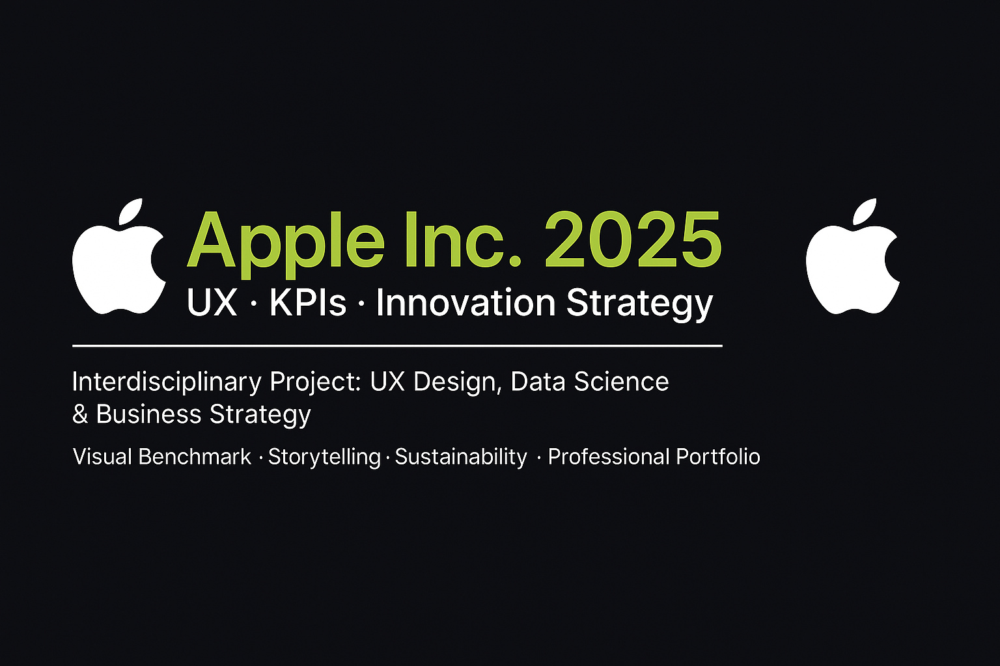

# -Apple-Inc.-2025-UX-KPIs-Innovation-Strategy
Proyecto profesional interdisciplinario que integra diseño UX, analítica de datos y estrategia de negocio, basado en métricas reales de Apple FY2024-2025. Incluye visualizaciones avanzadas, storytelling técnico y enfoque sostenible.
# 🍏 Análisis Interdisciplinario · Apple Inc. 2025

**Autor:** David Sebastián Díaz  
**Título profesional:** Analista Certificado en UX, Data & Marketing  
**Certificaciones:** Google UX Design · Google Digital Marketing · Business Intelligence · Marketing Analytics

---

## 📌 Descripción del Proyecto

Estudio estratégico y visual de Apple Inc., integrando **datos financieros reales, visualizaciones interactivas**, análisis de **UX benchmarking** y evaluación de sostenibilidad. Este proyecto es parte de mi portfolio profesional como analista interdisciplinario.

El enfoque combina **inteligencia de negocio**, **diseño de experiencia de usuario** y **marketing de datos** para comunicar insights clave de forma clara, visual y accionable.

---

## 🎯 Objetivos

- Visualizar el rendimiento global de Apple FY2024-2025
- Evaluar UX y engagement comparado con otras big tech
- Mapear ingresos y ventas con gráficos técnicos y mapas
- Explorar innovación, IA y expansión industrial
- Comunicar KPIs con storytelling estratégico y bilingüe

---

## 📊 Contenido del Análisis

| Sección | Descripción |
|--------|-------------|
| **1. Introducción Estratégica** | Contexto y objetivo del análisis |
| **2. KPIs Financieros** | Ingresos, capitalización, margen bruto, empleados |
| **3. Gráfico Sankey** | Distribución de ingresos por categoría |
| **4. Radar UX Comparativo** | Apple vs Samsung vs Google (usabilidad, branding, accesibilidad, engagement) |
| **5. Heatmap Global de Ventas** | América, Europa, China, Asia y Japón |
| **6. Innovación 2025** | IA, Apple Vision Pro, producción global |
| **7. Sostenibilidad** | Estrategias de carbono neutral y reciclaje |
| **8. Portfolio Profesional** | Slide técnica, QR, versión PDF y visuales listos para LinkedIn |

---

## 🌍 Tecnologías y Herramientas

- `Python (Pandas, Plotly, Seaborn)`
- `Figma / Illustrator`
- `Google Sheets`
- `Canva Pro`
- `Markdown / GitHub`

---

## 📁 Estructura del Repositorio
## 🇬🇧 English Version

[Click here for the English version of this README](./README_en.md) ✅
