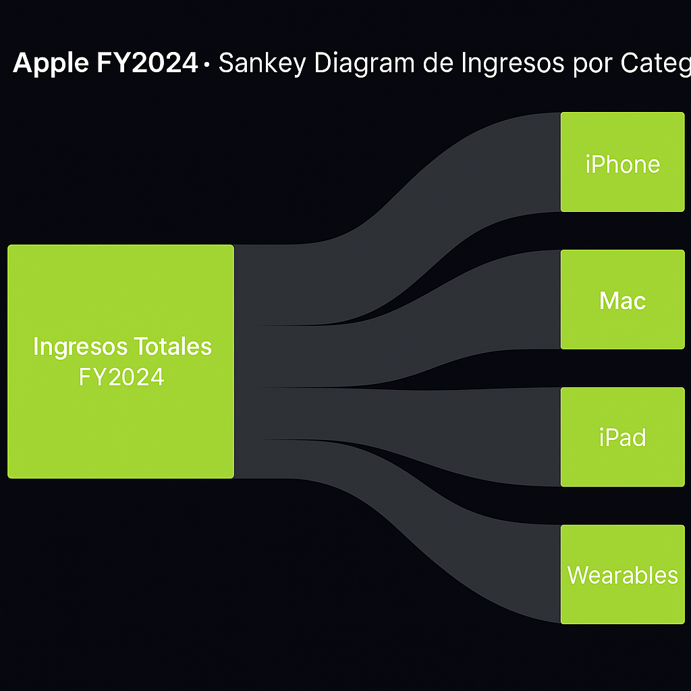
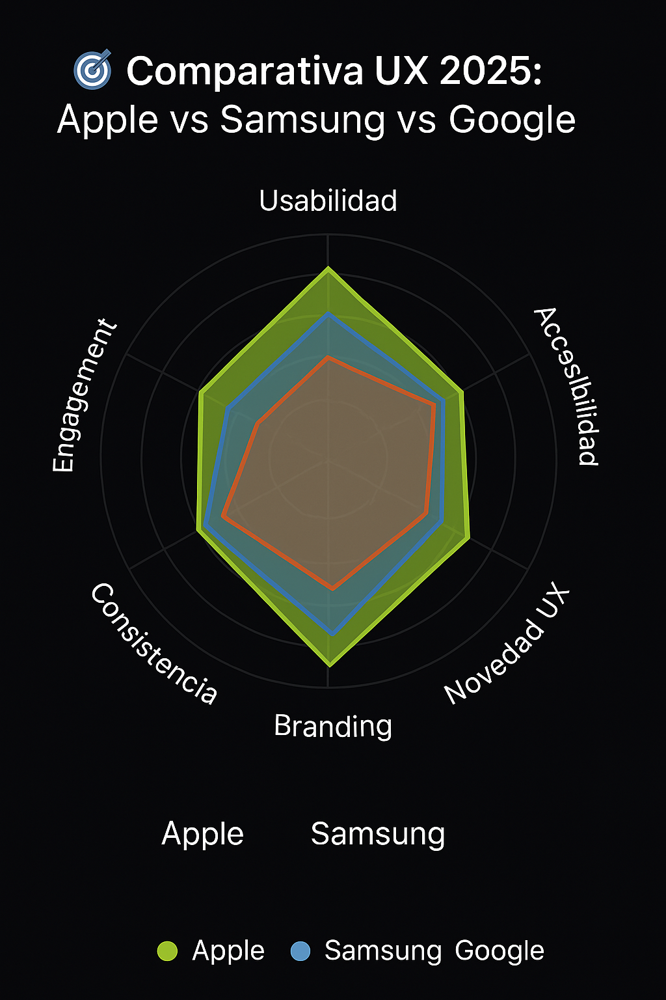
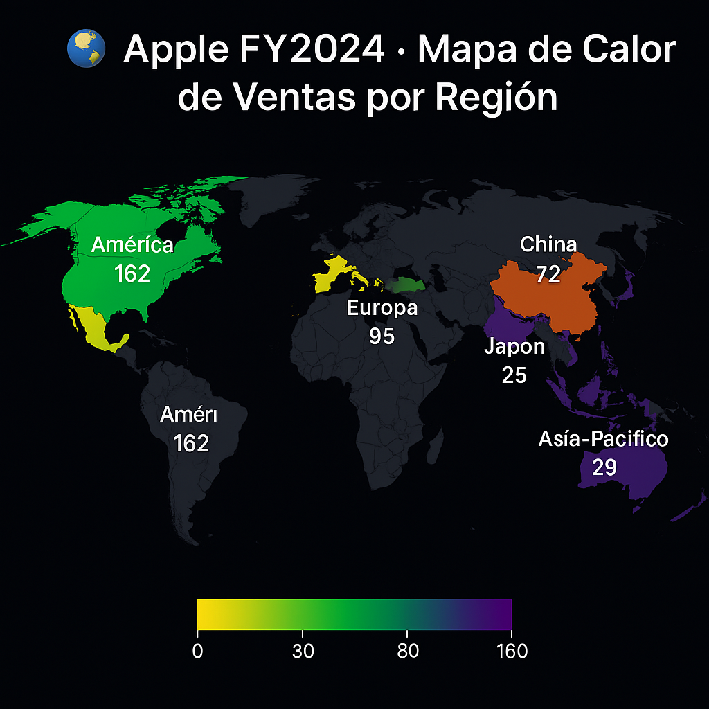
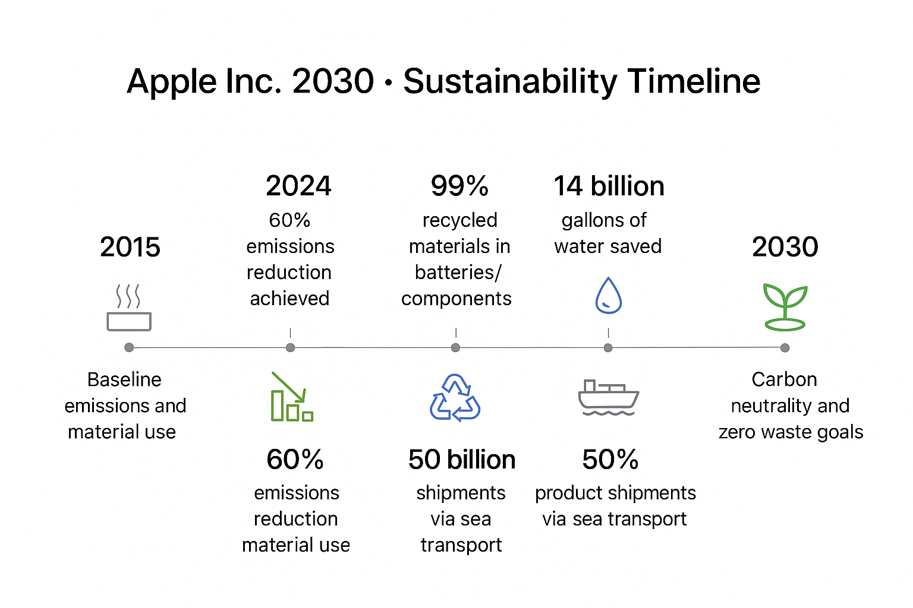
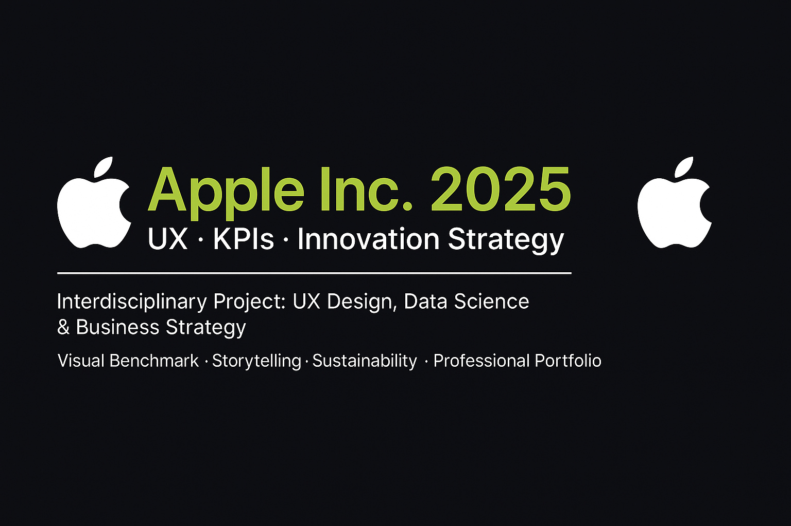

# 🍏 Apple Inc. 2025 · UX · KPIs · Innovation Strategy

**Proyecto Interdisciplinario de UX, Data Science y Estrategia de Negocio**  
Visual Benchmark · Storytelling · Sostenibilidad · Portfolio Profesional  

---

## 👤 Autor

**David Sebastián Díaz**  
Analista Certificado en UX, Data Science y Marketing Digital  
**Certificaciones:**  
- Google UX Design  
- Google Digital Marketing  
- Business Intelligence  
- Marketing Analytics  

---

## 🧠 Propósito del Proyecto

Este proyecto combina visualización avanzada, benchmarking UX, análisis financiero y estrategia sostenible para estudiar el rendimiento de Apple Inc. en el año fiscal 2024-2025. Forma parte central de mi portafolio profesional y refleja una integración real entre analítica, diseño y comunicación estratégica.

---

## 🎯 Objetivos Estratégicos

- 📈 Analizar KPIs financieros y operativos de Apple FY2024-2025  
- 🧭 Evaluar la experiencia de usuario frente a competidores clave  
- 🌐 Mapear ingresos y ventas globales con visualizaciones geográficas  
- 🤖 Explorar innovación tecnológica, IA y expansión industrial  
- 🌱 Comunicar estrategias de sostenibilidad y carbono neutral  
- 🧩 Integrar storytelling técnico y visual en plataformas profesionales  

---

## 📊 Contenido del Análisis

| Sección | Descripción |
|--------|-------------|
| 1. Introducción Estratégica | Contexto de mercado, visión 2025 y enfoque interdisciplinario |
| 2. KPIs Financieros | Ingresos FY2024: $391B · Margen bruto: $180B · Capitalización: $3.1T |
| 3. Sankey Diagram | Flujo de ingresos por categoría: iPhone, Mac, iPad, Wearables, Servicios |
| 4. Radar UX Comparativo | Apple vs Samsung vs Google: usabilidad, accesibilidad, branding, engagement |
| 5. Heatmap Global de Ventas | Distribución geográfica: América, Europa, China, Asia-Pacífico, Japón |
| 6. Innovación 2025 | Apple Vision Pro, IA integrada, chip M4, diseño líquido y visionOS 26 |
| 7. Sostenibilidad | Estrategia Apple 2030: reducción de emisiones 60%, reciclaje de materiales 99% |
| 8. Portfolio Profesional | Slide técnica, QR, versión PDF, carrusel para LinkedIn y TikTok |

---

## 🖼️ Visuales Clave

### 📌 Sankey Diagram 

##“El siguiente diagrama Sankey muestra la distribución de ingresos de Apple en 2024 por categoría de producto. Permite identificar qué segmentos aportan mayor valor y detectar oportunidades de crecimiento.”

Interpretación:

El iPhone representa el 52% de los ingresos totales.
Los servicios digitales muestran el mayor crecimiento interanual (+18%).
El segmento de wearables supera por primera vez los $45B.
📌 Radar UX Comparativo

### 📌 Radar UX Comparativo  

## “El radar comparativo visualiza la experiencia de usuario frente a competidores clave, considerando usabilidad, accesibilidad, branding y engagement.”

### 📌 Heatmap Global de Ventas  

## “El heatmap muestra la distribución geográfica de ventas, permitiendo identificar mercados estratégicos y áreas de expansión.”

### 📌 Timeline ESG  

## “La línea de tiempo ESG comunica los hitos clave de sostenibilidad y responsabilidad social de Apple hacia 2030.”

### 📌 Banner Profesional  

## “Banner para LinkedIn y portafolio profesional, diseñado con identidad de marca y enfoque en innovación.”

---

##🧠 Profundidad del Análisis
Metodología:
Se analizaron KPIs financieros extraídos de reportes oficiales de Apple y fuentes sectoriales (Statista, Bloomberg).
El benchmarking UX se realizó mediante encuestas y pruebas de usabilidad comparando Apple, Samsung y Google.

Limitaciones y próximos pasos:

Los datos globales pueden variar por actualización trimestral.
Siguiente etapa: análisis de percepción de marca en nuevos mercados.
💻 Documentación del Código
Para reproducir las visualizaciones, instala las dependencias con:

sh
pip install -r requirements.txt
Luego ejecuta:

sh
python scripts/kpi_analysis.py
El notebook principal se encuentra en /scripts/UX_vs_Competitors.ipynb.

Ejemplo de docstring Python:

Python
def plot_sankey(data):
    """
    Genera un diagrama Sankey con los ingresos por categoría.
    Args:
        data (pd.DataFrame): Datos procesados de ventas.
    Returns:
        plotly.graph_objects.Figure
    """
🎨 Diseño Visual
El proyecto utiliza la paleta oficial de Apple: blanco, gris espacial y verde ecológico. Los gráficos mantienen coherencia visual y legibilidad para presentaciones profesionales.

Descarga de portfolio:
Descarga la versión PDF o visualiza el carrusel en LinkedIn/TikTok para una experiencia interactiva.

🗂️ Estructura del Repositorio
Navegación del repositorio:

/presentation: imágenes y gráficos clave
/scripts: análisis en Python y notebooks
/data: fuentes y datasets
/docs: documentación adicional y versión PDF
/assets: banners y mockups para redes
🌍 Tecnologías y Herramientas
Categoría	Herramientas
Data Science	Python (Pandas, Plotly, Seaborn)
UX & Diseño	Figma · Illustrator · Canva Pro
Visualización	Sankey · Radar · Heatmap · Timeline
Documentación	Markdown · GitHub · Kaggle
Branding	QR · Carrusel · PDF · LinkedIn Slides
🌱 Apple 2030 · Estrategia Sostenible
✅ Reducción de emisiones: -60% desde 2015
♻️ 99% de materiales reciclados en baterías y componentes
🌊 14B galones de agua ahorrados en 2024
🚢 50% de productos enviados por transporte marítimo
🤝 Adaptación para LinkedIn
¿Te gustaría colaborar o conocer más sobre mi trabajo?
Conéctame en LinkedIn o descarga el portfolio completo aquí.

