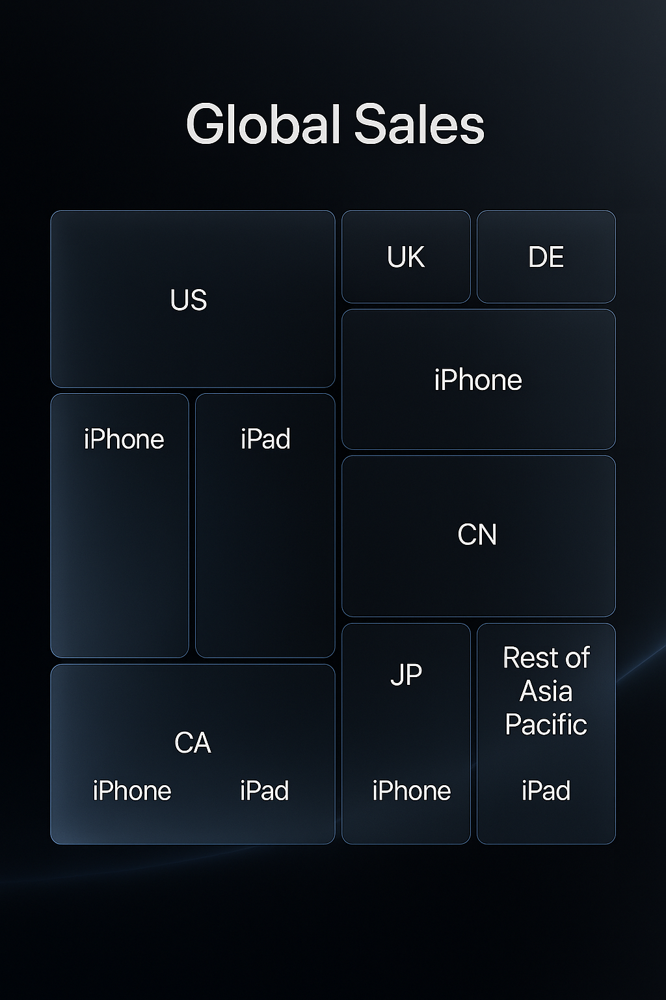

<p align="center">
  
</p>

# 📊 Apple Inc. Corporate Benchmarking FY24-25: A Strategic Deep Dive 🌐

*An interdisciplinary analysis focused on **Innovation**, **UX Strategy**, **KPIs Performance**, **Sustainability**, and **Data Storytelling**.*

---

### **Executive Summary**

This repository contains a comprehensive corporate benchmarking analysis of Apple Inc. for the fiscal years 2024-2025. The project adopts an interdisciplinary consulting methodology, integrating financial data, UX research, sustainability metrics, and market innovation trends. The primary objective is to deconstruct Apple's corporate strategy, operational excellence, and brand positioning, transforming complex data into actionable strategic insights. This portfolio piece is designed for senior consultants, technical recruiters, and global strategy teams, showcasing advanced analytical capabilities and a holistic understanding of a technology industry leader.

---

### **Resumen Ejecutivo**

Este repositorio contiene un análisis exhaustivo de benchmarking corporativo de Apple Inc. para los años fiscales 2024-2025. El proyecto adopta una metodología de consultoría interdisciplinaria, integrando datos financieros, investigación de UX, métricas de sostenibilidad y tendencias de innovación de mercado. El objetivo principal es deconstruir la estrategia corporativa, la excelencia operativa y el posicionamiento de marca de Apple, transformando datos complejos en insights estratégicos accionables. Este portafolio está diseñado para consultores senior, reclutadores técnicos y equipos de estrategia global, demostrando capacidades analíticas avanzadas y una comprensión holística de un líder en la industria tecnológica.

---

## 👨‍💻 Author's Profile | Perfil del Autor

| Category | Details |
| :--- | :--- |
| **Name** | David S. Diaz |
| **Current Role** | Senior Corporate Benchmarking Consultant |
| **Core Expertise** | Data Analysis, UX Strategy, Corporate Sustainability, Financial KPIs |
| **Professional Focus** | Bridging quantitative analysis with qualitative insights for Fortune 500 tech companies. |
| **Certifications** | 🏆 UX Certified (Nielsen Norman Group)<br>🔬 IBM Data Science Professional Certificate<br>🎨 Google UX Design Professional Certificate<br>📈 PMI Project Management Professional (PMP)® |

---

## 📊 Visual Analytics Dashboard | Panel de Análisis Visual

This section presents the core visual assets generated for this analysis, providing a high-level overview of key findings.

| Analysis Area | Description | Visual Asset |
| :--- | :--- | :--- |
| **Revenue Breakdown** | Sankey diagram illustrating revenue streams by product category for FY2025. |  |
| **UX Benchmark** | Radar chart comparing Apple's UX performance against key competitors (Samsung, Google). |  |
| **Global Sales** | Treemap showcasing the relative weight of sales distribution across global regions. |  |
| **Sustainability Path** | Timeline tracking Apple's progress towards its 2030 carbon neutrality commitment. |  |

---

## 🛠️ Methodology | Metodología

This analysis is built upon a robust, multi-source methodology designed to ensure accuracy and depth.

*   **Data Sources:**
    *   **Primary:** Apple Inc. SEC Filings (10-K, 10-Q), Annual ESG Reports, Investor Relations Calls.
    *   **Secondary:** Market intelligence from Gartner, Forrester, and IDC; academic research from platforms like JSTOR; financial data APIs.
*   **Analytical Techniques:**
    *   **Quantitative:** Financial Ratio Analysis, Regression Analysis (Python/R), Time-Series Forecasting.
    *   **Qualitative:** Heuristic Evaluation (Nielsen's Principles), PESTLE Analysis, Content Analysis of customer reviews.
*   **UX Standards Compliance:**
    *   Analysis references WCAG (Web Content Accessibility Guidelines) 2.2 and ISO 9241-210 (Human-centered design).

---

## 🎨 Apple's Visual Palette | Paleta Visual de Apple

The project's visual assets adhere to Apple's clean and modern aesthetic. The official color palette used is:

| Color Name | HEX Code | Swatch |
| :--- | :--- | :--- |
| **Space Gray** | `#5f5f5f` | ⚫ |
| **Blue** | `#007aff` | 🔵 |
| **Green** | `#34c759` | 🟢 |
| **Gold** | `#ffcc00` | 🟡 |
| **White** | `#ffffff` | ⚪ |

---

## 📂 Repository Structure | Estructura del Repositorio

The repository is organized to facilitate clarity and ease of navigation for both technical and non-technical audiences.

```markdown
/
├── assets/
│   └── visuals/
│       ├── github_banner.png
│       ├── kpi_sankey_revenue.png
│       ├── ux_radar_benchmark.png
│       ├── global_sales_treemap.png
│       └── sustainability_timeline.png
├── data/
│   ├── raw/
│   └── processed/
├── notebooks/
│   └── apple_visuals_generator.py
├── presentation/
│   └── Apple_Benchmarking_FY24-25_Executive_Deck.pdf
└── README.md
```

---

## 💻 Technologies & Tools | Tecnologías y Herramientas

| Technology / Tool | Purpose |
| :--- | :--- |
| **Python (Plotly, Matplotlib, Seaborn)** | Data wrangling, statistical analysis, and interactive data visualization. |
| **Pandas & NumPy** | High-performance data manipulation and numerical analysis. |
| **Pillow** | Image generation for custom visual assets like banners. |
| **Jupyter Notebook** | Prototyping, iterative analysis, and reproducible research. |
| **Markdown** | Documentation, reporting, and knowledge sharing. |

---

## 🌿 Apple's 2030 Sustainability Commitment

A core component of this benchmark is the evaluation of Apple's ambitious goal to be **carbon neutral across its entire business, manufacturing supply chain, and product life cycle by 2030.**

*   **Key Goals:**
    *   **100% renewable energy** for corporate operations (Achieved).
    *   **75% reduction in emissions** by 2030 from a 2015 baseline.
    *   **Carbon removal solutions** for the remaining 25% of emissions.
*   **Ecological Indicators Tracked:**
    *   Carbon footprint (Scope 1, 2, 3).
    *   Use of recycled materials (e.g., cobalt, tin, gold).
    *   Water stewardship and energy efficiency in the supply chain.

---

## 🚀 Call to Action

I am always open to connecting with fellow professionals, recruiters, and strategists. Let's explore how data-driven insights can shape the future of technology.

*   **🤝 Connect with me on [LinkedIn](https://www.linkedin.com/in/dsd228).**
*   **📄 For a summarized executive overview, please see the slide deck in the `/presentation` folder.**

---

## 🌐 Let's Connect

Feel free to reach out to discuss this project, potential collaborations, or consulting opportunities.

*   **📧 Email:** `david.s.diaz.consulting@email.com`
*   **🔗 LinkedIn:** `https://www.linkedin.com/in/dsd228`

---

<p align="center">
  <small>© 2025 David S. Diaz | Corporate Benchmarking Analysis | International Consulting Approach</small>
</p>


